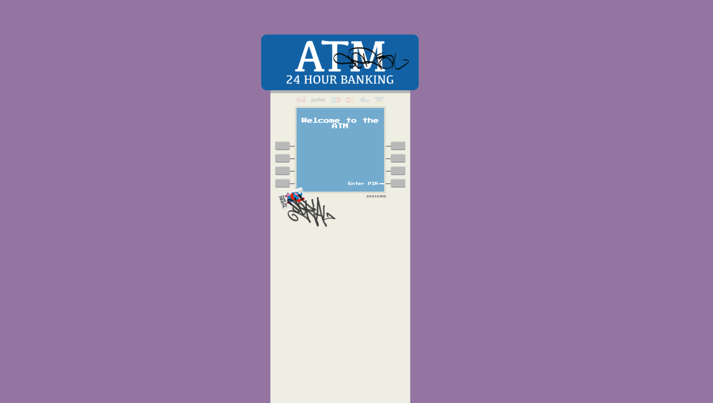

# Casetext Homework Assignment
Your task in this challenge is to build a demo web app that is a functional ATM machine. We aren’t expecting you to spend a tremendous amount of time on this (i.e. ~2-4hrs), so non-production worthy code is a-ok. Please use a stubbed backend as if you were interacting with a server (ie reading from a file or localstorage). Feel free to add any bells and whistles you’d like.

## Guidelines:
- Please work in Javascript or Typescript and use any frameworks or libraries you like.
- Match the provided mocks as closely as possible 
- Please use provided assets
- A user should be able to check their balance, withdraw funds, and deposit funds after entering their PIN at a minimum
- Funds should be correctly reflected after a deposit or withdrawal
- A users card type should be highlighted once they have entered their correct PIN
- Please put your code up on your github account.  
- Please include instructions about how we can run your app. (if your solution works better in one browser over the others, let us know which one)

## Optional:
- If you feel like going above and beyond, wire up the client to a NodeJS backend server with express and handle all transactions on the server.

## Mocks:



## How to Run:

Install node modules
```
npm i
```

Run app

```
npm run dev
```


## Dev Notes:

Numbers 1-8 in `page.tsx` refer to ATM buttons

1-4 for left side buttons, 5-8 for right side butttons
